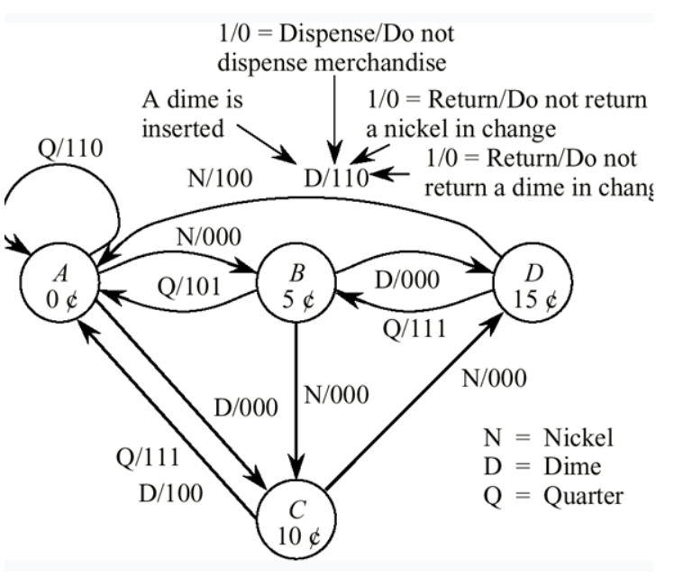

# ASC - Automat Vanzari
 
Se da un automat de vanzari definit de diagrama de mai jos:  

   
Scrieti un program C# care sa modeleze functionarea acestui automat.  

### Precizari
- marfa se elibereaza cand in aparat sunt cel putin 20 centi (20 de centi fiind pretul produsului).   
- dupa eliberarea produsului se va da si rest (in cazul in care in automat sunt mai mult de 20 centi). 